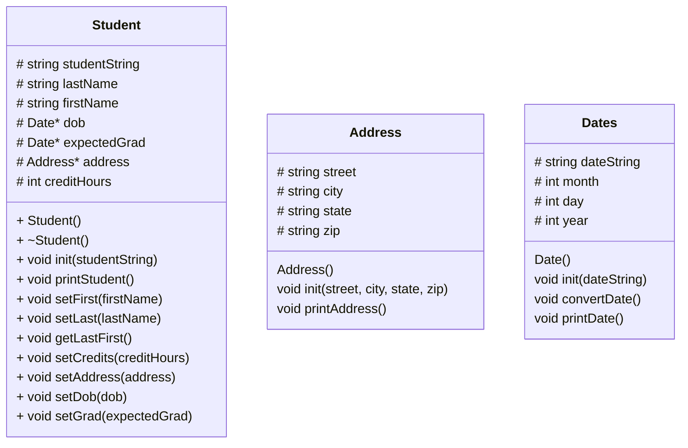

# 121Lab-StudentHeap

## UML


## Address::Address()
```
set street to NA
set city to NA
set state to NA
set zip to NA
```

## Address::init(string street, string city, string state, zip)
```
set Address::street to street
set Address::city to city
set Address::state to state
set Address::zip to zip
```

## Address::printAddress()
```
print street, city, state, zip
```

## Date::Date()
```
set month to 0
set day to 0
set year to 0
set dateString to NA
```

## Date::init(dateString)
```
set Date::dateString to dateString
```

## Address::printDate()
```
print Date::dateString
```

## Student::Student()
```
initialize variables w/ placeholders
```

## Student::~Student()
```
delete Date* dob
delete Date* expectedGrad
delete Address* address
```

## Student::init(studentString)
```
set Student::studentString to studentString
```

## Student::printStudent()
```
print all student info (first and last name, dob, etc.)
```

## Student::setFirst(firstName)
```
set Student::firstName to firstName
```

## Student::setLast(lastName)
```
set Student::lastName to lastName
```

## Student::getLastFirst()
```
print lastName, firstName
```

## Student::setCredits(creditHours)
```
set Student::creditHours to creditHours
```

## Student::setAddress(address)
```
set Address* address to adress
```

## Student::setDob(dob)
```
set Date* dob to dob
```

## Student::setGrad(expectedGrad)
```
set Date* expectedGrad to expectedGrad
```
